# Mermaid Syntax Reference

You MUST follow this reference exactly when generating mermaid diagrams. Copy the patterns below.

## Code Fence Format

Every mermaid diagram uses this exact structure:

    ```mermaid
    <diagram-type-keyword>
        <content>
    ```

The code fence language is always `mermaid`. The diagram type keyword is always the first line inside the block.

## Common Diagram Examples — Copy These Exactly

### Bar/Line Chart (keyword: xychart-beta)

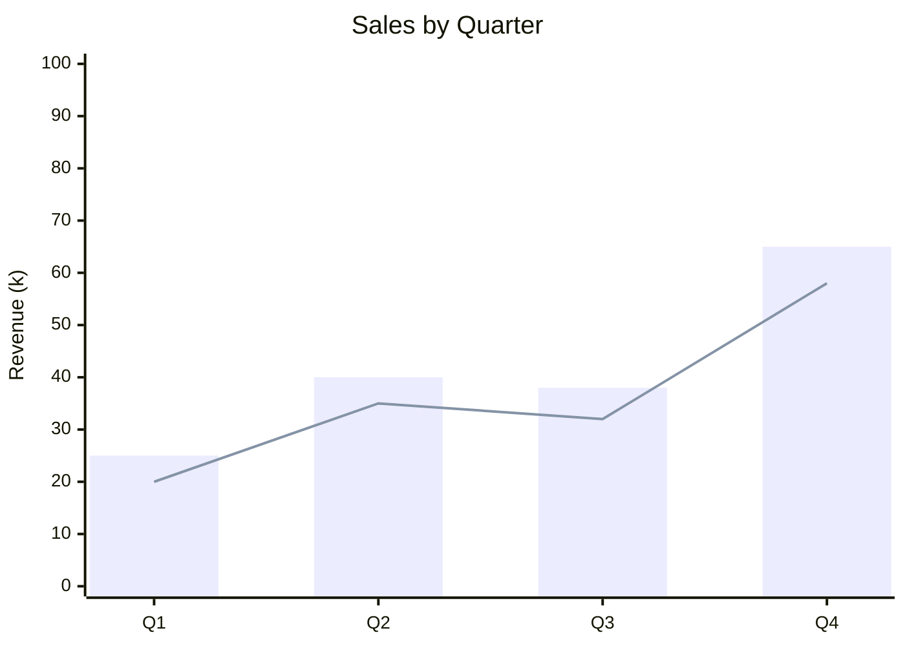

### Pie Chart (keyword: pie)


### Flowchart (keyword: graph LR or graph TD)

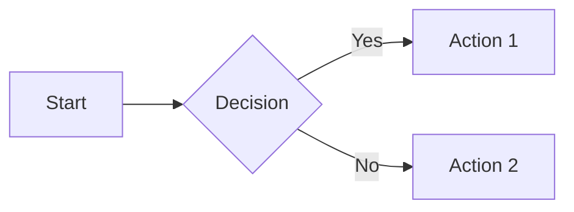

## Diagram Type Keywords

The first line inside the mermaid block MUST be one of these exact keywords. Anything else fails to render.

| Keyword | Type |
|---------|------|
| `graph LR` / `graph TD` / `flowchart LR` | Flowchart |
| `sequenceDiagram` | Sequence diagram |
| `classDiagram` | Class diagram |
| `stateDiagram-v2` | State diagram |
| `erDiagram` | Entity-relationship |
| `mindmap` | Mind map |
| `timeline` | Timeline |
| `pie` | Pie chart |
| `xychart-beta` | Bar/line charts (NOT "bar", "chart", or "xychart") |
| `quadrantChart` | Quadrant/2x2 matrix |
| `gantt` | Gantt chart |
| `block-beta` | Block/architecture diagram |
| `sankey-beta` | Sankey flow diagram |
| `gitGraph` | Git branch visualization |

## Flowchart

Direction keywords: `TB` (top-bottom), `TD` (top-down), `BT`, `LR` (left-right), `RL`

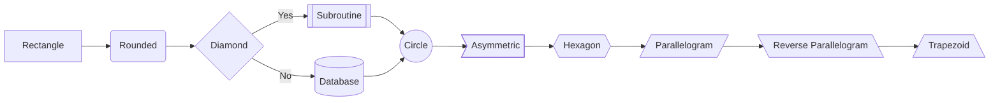

### Subgraphs
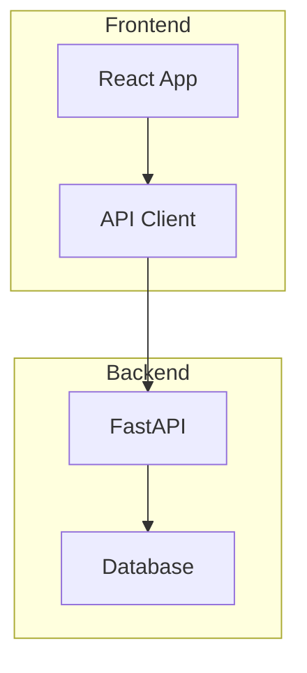

### Link styles
```
A --> B           %% Arrow
A --- B           %% Line
A -.-> B          %% Dotted arrow
A ==> B           %% Thick arrow
A --text--> B     %% Arrow with text
A -->|text| B     %% Arrow with text (alt)
A ~~~ B           %% Invisible link
```

### Styling
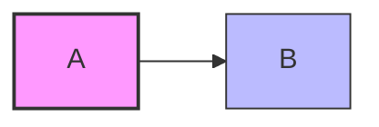

## Sequence Diagram

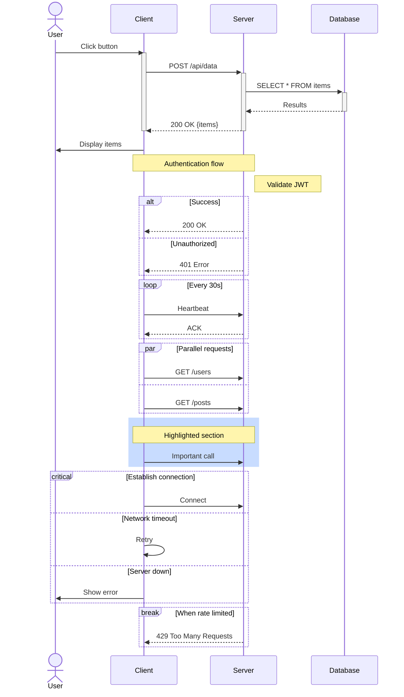

### Arrow types
```
->>   Solid arrow (request)
-->>  Dashed arrow (response)
-)    Open arrow (async)
--)   Dashed open arrow
-x    Cross (lost message)
--x   Dashed cross
```

## Class Diagram

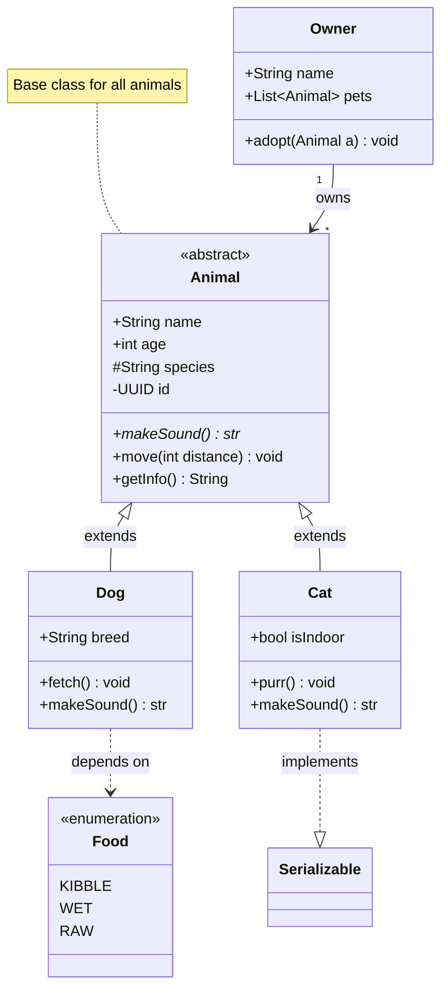

### Relationships
```
<|--   Inheritance
*--    Composition
o--    Aggregation
-->    Association
--     Link (solid)
..>    Dependency
..|>   Realization/Implementation
```

### Cardinality
```
"1"    Exactly one
"0..1" Zero or one
"1..*" One or more
"*"    Many
"n"    N instances
```

## State Diagram

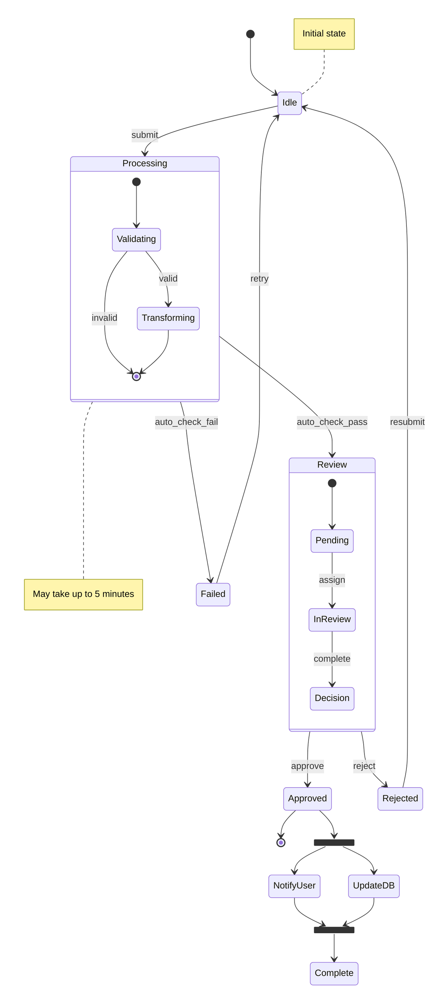

## Entity-Relationship Diagram

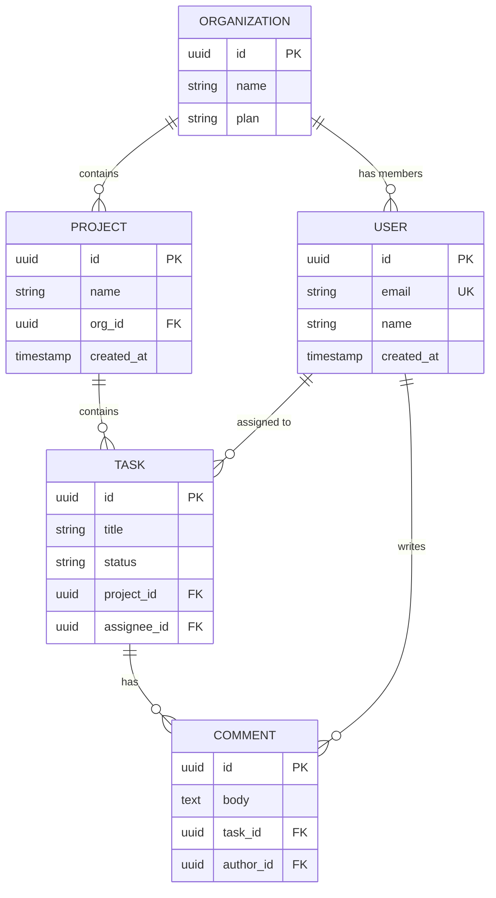

### Relationship types
```
||--||   Exactly one to exactly one
||--o{   One to zero or more
||--|{   One to one or more
}o--o{   Zero or more to zero or more
```

### Attribute keys
```
PK   Primary key
FK   Foreign key
UK   Unique key
```

## Mindmap

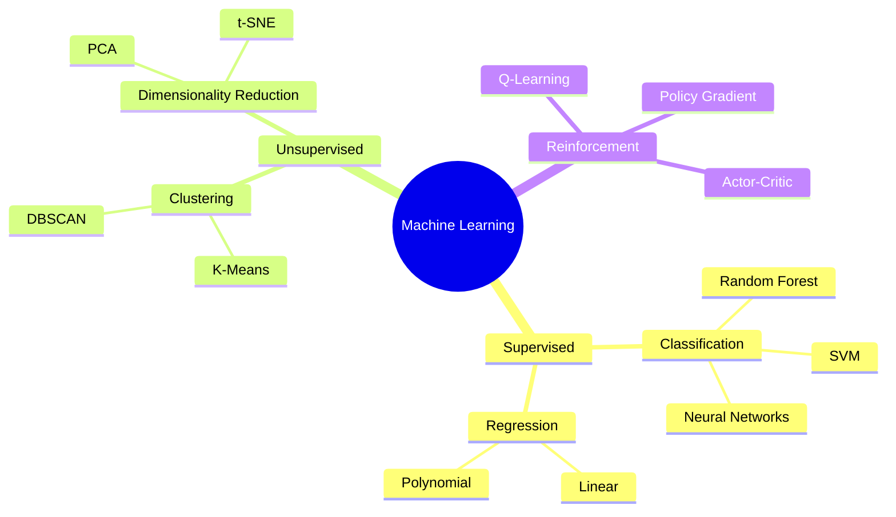

Node shapes:
- `((text))` — circle (root)
- `(text)` — rounded rectangle
- `[text]` — square
- `))text((` — bang
- `)text(` — cloud
- `{{text}}` — hexagon

## Timeline

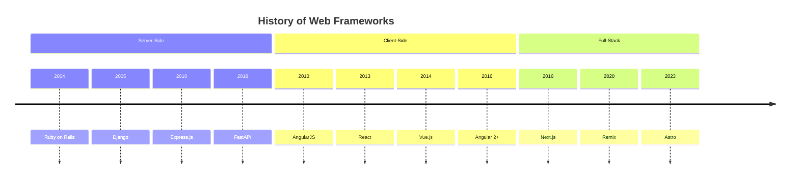

## XY Chart (Bar and Line Charts)

IMPORTANT: The keyword is `xychart-beta` — NOT "bar", "chart", or "xychart".


### Horizontal orientation
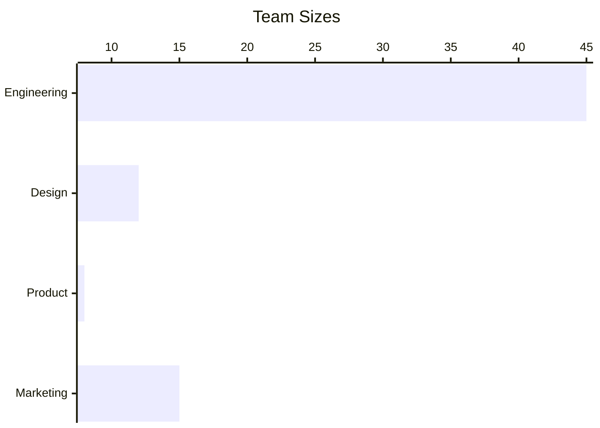

### Syntax
- `xychart-beta` or `xychart-beta horizontal` — starts the chart
- `title "Chart Title"` — optional title (quotes required for multi-word)
- `x-axis [cat1, cat2, cat3]` — categorical x-axis labels
- `x-axis "Title" min --> max` — numeric x-axis range
- `y-axis "Title" min --> max` — numeric y-axis range (or auto-range without min/max)
- `bar [val1, val2, val3]` — bar series
- `line [val1, val2, val3]` — line series
- Multiple `bar` and `line` series can be combined in one chart

## Sankey Diagram

IMPORTANT: The keyword is `sankey-beta`. Uses CSV format: source, target, value.

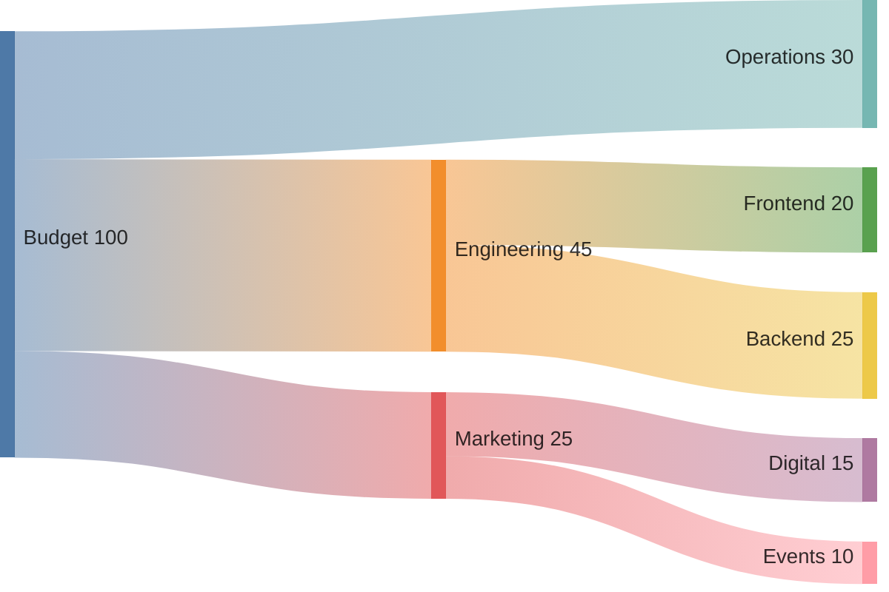

## Quadrant Chart

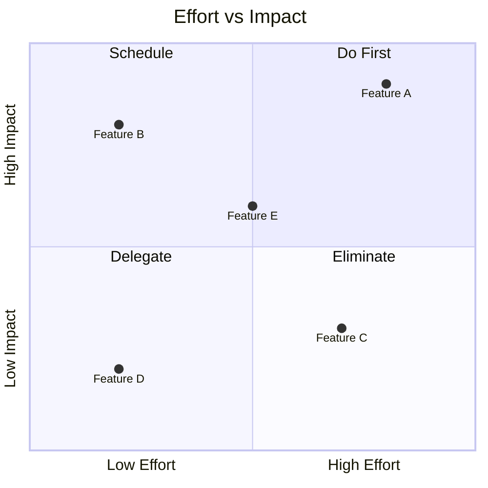

## Block Diagram

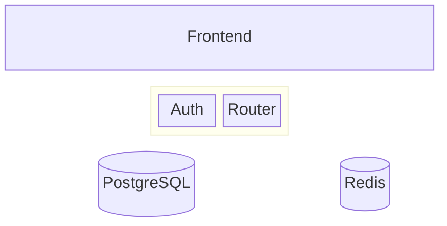

## Pie Chart

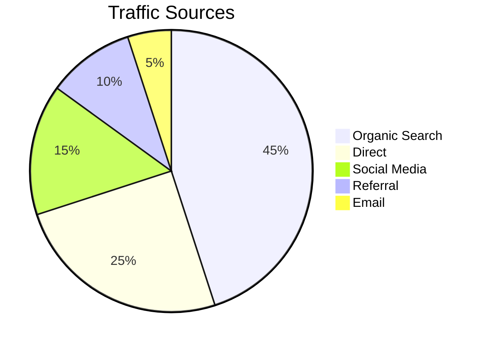

## Git Graph

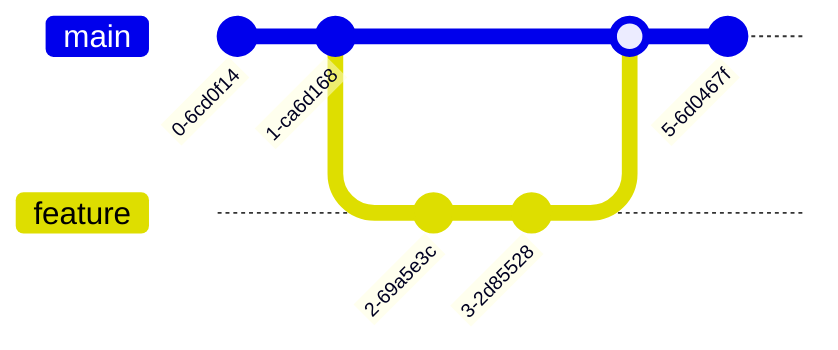

## Tips

- Keep node labels short (1-4 words). Move details to notes or descriptions.
- Use subgraphs/groups to organize complex diagrams.
- Color and style sparingly — only to highlight key elements.
- Test diagram renders before saving — common errors include missing quotes around labels with spaces and mismatched brackets.
- For flowcharts with many nodes, prefer LR (left-right) direction for readability.
- Sequence diagrams: use `activate`/`deactivate` to show lifelines clearly.
- Use `%%` for comments in Mermaid source.
